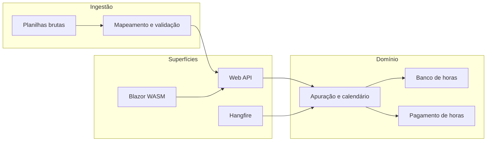

# ChronosPoint

Plataforma **SaaS multi-tenant** para automatizar a gestão, correção e apuração de **pontos eletrônicos**, com foco em escritórios de contabilidade e departamentos de RH que hoje fecham o mês em planilhas.

> Repositório de produto em evolução: documentação pensada para **portfólio** e visão de produto, sem expor credenciais, ambientes internos ou procedimentos de implantação.

## Visão do produto

O **ChronosPoint** recebe batidas e jornadas vindas de sistemas legados (tipicamente exportações em planilhas), **padroniza** os dados, associa colaboradores de forma **determinística por identificador**, aplica regras de carga horária e apuração, e produz **relatórios auditáveis** e artefatos de impressão alinhados ao modelo operacional do cliente.

Objetivos centrais:

- Reduzir erro humano na associação nome, matrícula e batidas.
- Acelerar o **fechamento mensal** com conferência guiada e histórico.
- Manter **rastreabilidade** de importações, correções, exportações e pagamentos de horas.

## Principais funcionalidades (roadmap / escopo)

| Área | Descrição |
|------|-----------|
| **Engine de importação** | Leitura de planilhas padronizadas (layout configurável por tenant), mapeamento de colunas e vínculo automático a colaboradores e jornadas cadastradas. |
| **Painel de conferência (Check-and-Go)** | Fluxo para inconsistências: batidas faltantes, intervalos, extras não autorizadas, ajustes com registro de quem alterou e quando. |
| **Calendário e apuração** | Preenchimento de período (início/fim da apuração), fechamento por competência, cálculo de variáveis e **banco de horas** conforme políticas do tenant. |
| **Exportação** | Geração de relatórios no formato esperado pelo cliente (incl. cabeçalhos com dias no padrão XLS quando aplicável), armazenamento versionado. |
| **CRM operacional** | Cadastro enriquecido: nome amigável, vínculo estável por **ID** (a mesma chave usada na importação elimina ambiguidade de nomes abreviados na planilha). |
| **Remuneração e freelancer** | Salário ou valor dia ou mês, **calculadora de valor-hora**, pagamento de horas que **zera** saldo pago no período mantendo histórico (horas pagas, valores). |
| **Armazenamento por colaborador** | Artefatos e preenchimentos organizados em estrutura lógica (ex.: pastas por funcionário na infraestrutura do tenant), adequado a auditoria e backup. |

## Stack tecnológica (logos)

<p align="left">
  <a href="https://dotnet.microsoft.com/apps/aspnet" title="ASP.NET Core"></a>
  <a href="https://learn.microsoft.com/dotnet/csharp/" title="C#"></a>
  <a href="https://dotnet.microsoft.com/apps/aspnet/web-apps/blazor" title="Blazor WebAssembly"></a>
  <a href="https://learn.microsoft.com/ef/core/" title="Entity Framework Core"></a>
  <a href="https://www.oracle.com/database/" title="Oracle Database"></a>
  <a href="https://www.hangfire.io/" title="Hangfire"></a>
</p>

<p align="left">
  
  
  
</p>

As imagens acima são badges (PNG via shields.io) e carregam direto no GitHub. Os links levam à documentação oficial de cada tecnologia.

## Arquitetura e stack (diretriz do projeto)

| Camada | Tecnologia |
|--------|------------|
| **Backend** | ASP.NET Core 9, Web API RESTful |
| **Frontend** | Blazor WebAssembly |
| **Persistência** | Entity Framework Core + Oracle |
| **Jobs / filas** | Hangfire (apuração e importações pesadas) |
| **Arquitetura** | Clean Architecture com orientação a **DDD** |
| **SaaS** | **Multi-tenant** com isolamento forte de dados por empresa cliente |

Diagrama conceitual (alto nível):



## Multi-tenant e segurança (visão)

- Isolamento de dados **por tenant** (empresa), com políticas de acesso por perfil.
- Dados sensíveis (connection strings, chaves de API, wallets Oracle, segredos de Hangfire) **não** devem ser versionados: ver [`docs/HANDOFF.md`](docs/HANDOFF.md) e `.gitignore`.
- Logs e exportações podem conter dados pessoais e trabalhistas: tratamento conforme LGPD e política interna do operador do sistema.

## O que este repositório não inclui (de propósito)

Para manter o repositório seguro e adequado a **portfólio público**:

- Credenciais, connection strings reais, URLs de ambientes internos.
- Scripts ou runbooks que reproduzam produção na íntegra.
- Planilhas com dados reais de colaboradores (quando houver exemplos, devem ser **anonimizados**).

Contribuições e evolução do código devem respeitar a mesma linha.

## Estrutura esperada do código (quando o monorepo for criado)

Sugestão de organização (ajuste conforme a implementação):

```
/src
  /ChronosPoint.Domain
  /ChronosPoint.Application
  /ChronosPoint.Infrastructure
  /ChronosPoint.Api
  /ChronosPoint.Web
/tests
/docs
```

Em `docs/` ficam só o passagem de bastão e o registo de alterações: [`HANDOFF.md`](docs/HANDOFF.md) e [`CHANGELOG.md`](docs/CHANGELOG.md).

## Licença e uso

Defina a licença no arquivo `LICENSE` quando publicar (por exemplo MIT, Apache-2.0 ou proprietária). Até lá, o código e a documentação são de uso restrito do autor, salvo indicação contrária.

## Contato / portfólio

Use este README como **cartão de visitas**: visão clara de produto, stack e maturidade arquitetural. Para trabalhar em duas máquinas com Cursor, use **[`docs/HANDOFF.md`](docs/HANDOFF.md)**. Para o que já mudou no repo, use **[`docs/CHANGELOG.md`](docs/CHANGELOG.md)**. O **`.gitignore`** ajuda a não subir segredos nem pastas de build.

*ChronosPoint: controle de ponto com propósito, menos planilha frágil, mais apuração confiável.*
